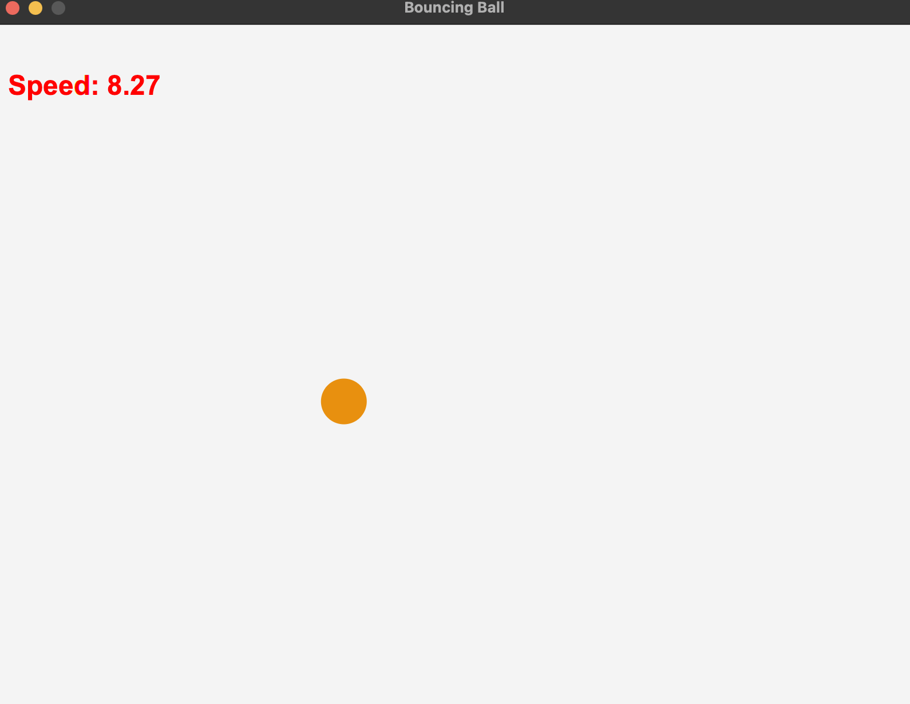

# Bouncing Ball Game with JavaFX

## Overview
The Bouncing Ball game is a simple, interactive JavaFX application where a ball bounces around the screen. Users can control the speed of the ball using the up and down arrow keys. The game demonstrates the use of JavaFX animation and event handling capabilities.

## User Interface

<p align="center" style="cursor: pointer">
    
</p>

## Features
- Ball speed control with keyboard inputs (UP to increase speed, DOWN to decrease speed).
- Dynamic color change of the ball upon collision with the screen boundaries.
- Display of current ball speed on the screen.

## Prerequisites
- JDK 11 or above.
- JavaFX SDK (compatible with your JDK version).

## Setup and Installation
1. **Download JavaFX SDK**: Download the JavaFX SDK from the [OpenJFX](https://openjfx.io/) website and extract it to a known location on your machine.
2. **Clone the Repository**: Clone this repository to your local machine using `git clone <repository-url>`.

## Configuration
Before running the application, ensure that JavaFX is properly configured in your IDE (e.g., IntelliJ IDEA, Eclipse):
- **IntelliJ IDEA**:
    1. Go to `File` > `Project Structure` > `Libraries` and add the JavaFX SDK as a library to the project.
    2. In the `Run` configurations, add the VM options to include the JavaFX modules:
       ```
       --module-path "path/to/javafx-sdk/lib" --add-modules javafx.controls,javafx.fxml
       ```
       Replace `"path/to/javafx-sdk/lib"` with the actual path to the JavaFX SDK lib directory on your machine.

- **Eclipse**:
    1. Right-click on the project > `Properties` > `Java Build Path` > `Libraries` and add the JavaFX SDK as an external JAR.
    2. In the run configurations, add the VM arguments similar to the IntelliJ setup.

## Running the Application
To run the application, navigate to the `src/com/example/bouncingballgamejavafx` directory and compile the `BouncingBall.java` file. Then, execute the main method within the `BouncingBall` class.

## Contributing
Contributions to the Bouncing Ball game are welcome. Please feel free to fork the repository, make your changes, and submit a pull request.

## License
This project is licensed under the MIT license. See [LICENSE](LICENSE) for more details.

---
